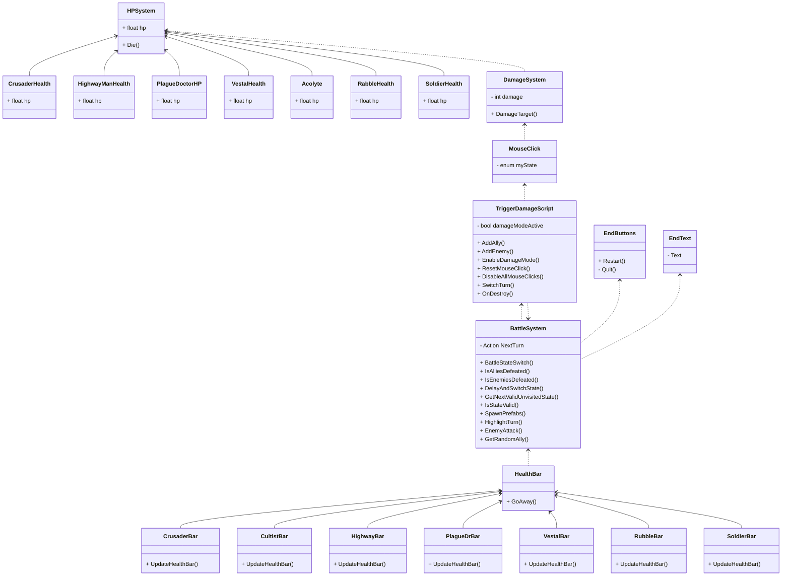

# UML-Opdracht11

## Opdracht A
Een UML componentendiagram wordt gebruikt om de hoge niveaustructuur van een softwaresysteem weer te geven. Het focust op de fysieke componenten van een systeem, zoals modules, bibliotheken, bestanden, en interfaces, en hoe deze met elkaar samenwerken. Het is handig in de ontwerpfase om de softwarearchitectuur te definiëren.

## Opdracht B

